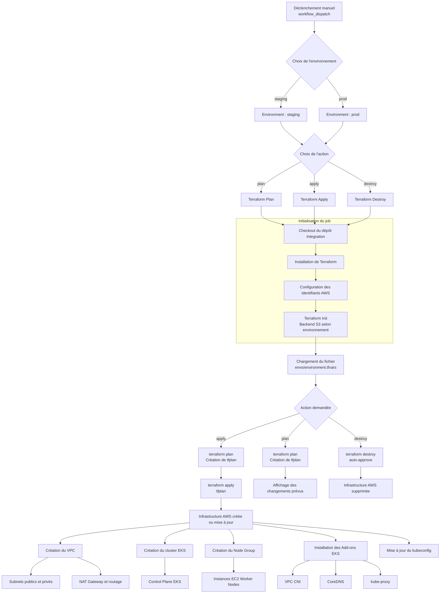

## Structure du pipeline Infrastructure

L'infrastructure des environnements est provisionnée à l'aide de Terraform via un workflow GitHub Actions dédié, déclenché manuellement.
Le workflow permet de crééer l’infra, mais aussi de modifier l’infra existante, ainsi que de détruire l’infra

Pour lancer un job d'infra :

- Ouvrir le dépôt GitHub et accéder à l'onglet Actions
- Sélectionner le workflow "Trigger infrastructure deployment"
- Cliquer sur "Run workflow"

Choix de l'option

-	plan : Terraform analyse les changements dans le code sans les appliquer
-	apply : Terraform applique les changements dans le code
-	plan-destroy : Terraform analyse la destruction l’appliquer
-	destroy : Terraform détruit l’environnement
 
Choix de l'environnement

- prod / staging

- Cliquer sur "Run workflow"

