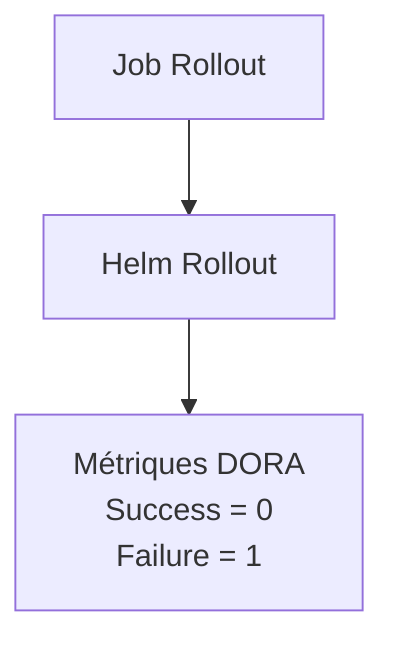

## Structure du pipeline de Rollback

Déclencher un rollback

En cas d'échec d'un déploiement ou si une régression est détectée après une mise en production, le workflow Rollout permet de revenir rapidement à la version précédemment déployée.

Pour lancer un rollback :

- Ouvrir le dépôt GitHub et accéder à l'onglet Actions
- Sélectionner le workflow "Trigger application rollback"
- Cliquer sur Run workflow
- Cliquer à nouveau sur "Run workflow"

Le pipeline exécute alors la commande Helm Rollback, attend la fin du redéploiement (kubectl rollout status) et vérifie que l'application est de nouveau opérationnelle avant de terminer le workflow.

