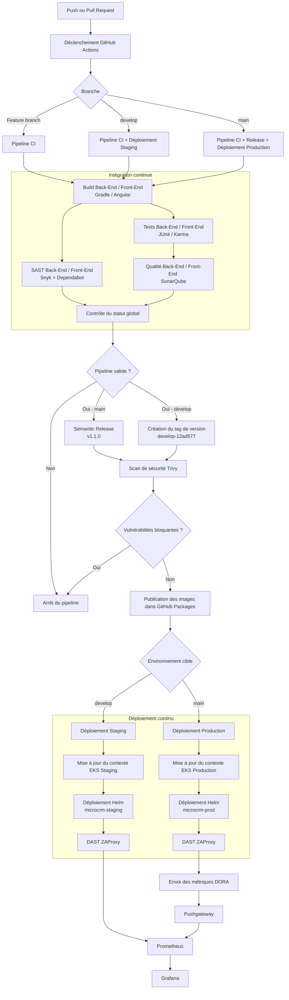

## Structure du pipeline CI/CD

Le pipeline automatise la compilation, les tests, l’analyse de qualité, la construction et l’analyse de sécurité des images Docker, puis leur déploiement sur les environnements AWS EKS de staging et de production. Les résultats des déploiements alimentent également les métriques DORA exposées dans Grafana.

Aucune intervention manuelle n'est nécessaire (hormis la création / validation de pull-request)

